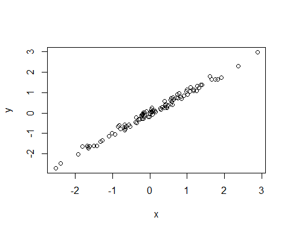
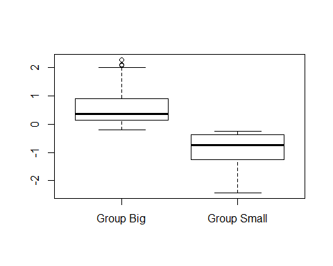

```
Warning: package 'knitcitations' was built under R version 3.3.2
```


\singlespace

\vspace{2mm}\hrule

Write your abstract here.

\vspace{3mm}\hrule

*Keywords*: rmarkdown, reproducible science

\doublespace

\bleft


# INTRODUCTION

Write your introduction here. You can cite bibliography like this [@Yan2011; @Sutherland2011], if you provide a `BibTeX` file with references. See http://rmarkdown.rstudio.com/authoring_bibliographies_and_citations.html for more information. Or you could also use [knitcitations](https://cran.r-project.org/web/packages/knitcitations/index.html) or [RefManageR](https://cran.r-project.org/web/packages/RefManageR/index.html) to fetch bibliographic metadata automatically from the web. For example, citing a paper can be as easy as providing its DOI [@Clark_2006] or even just a few keywords [@ricklefs2008disintegration]. They will then automagically appear in the list of cited references.[@Yan2011]

You can even specifiy the desired output format for your bibliography by including a style file for a specific journal (e.g. "ecology.csl"). Many different bibliography styles (CSL files) can be obtained at http://citationstyles.org/ or https://github.com/citation-style-language/styles.


# METHODS


## Study Area

We worked in a **beautiful** place with lots of trees, like *Quercus suber* and *Laurus nobilis*.


## Data collection and analysis


We applied a linear model where

$$
y_{i} = \alpha + \beta*x_{i} 
$$


We used the statistical language `R` [@R_Core_Team_2016] for all our analyses. These were implemented in dynamic rmarkdown documents using `knitr` [@Xie_2016; @Xie_2015; @Xie_2014] and `rmarkdown` [@Allaire_2016] packages. All the multilevel models were fitted with `lme4` [@Bates_2015]. 


# RESULTS

Trees in forest A grew taller than those in forest B (mean height: 25 versus 13 m). And many more cool results that get updated dynamically.


# DISCUSSION

Discuss.


# CONCLUSIONS


# ACKNOWLEDGEMENTS


# REFERENCES


<div id = "refs"></div>


\eleft

\clearpage


\listoftables


\newpage


| Sepal.Length| Sepal.Width| Petal.Length| Petal.Width|Species |
|------------:|-----------:|------------:|-----------:|:-------|
|          5.1|         3.5|          1.4|         0.2|setosa  |
|          4.9|         3.0|          1.4|         0.2|setosa  |
|          4.7|         3.2|          1.3|         0.2|setosa  |
|          4.6|         3.1|          1.5|         0.2|setosa  |
|          5.0|         3.6|          1.4|         0.2|setosa  |
|          5.4|         3.9|          1.7|         0.4|setosa  |


\newpage


|                    |  mpg| cyl|  disp|  hp| drat|    wt|  qsec| vs| am| gear| carb|
|:-------------------|----:|---:|-----:|---:|----:|-----:|-----:|--:|--:|----:|----:|
|Merc 280            | 19.2|   6| 167.6| 123| 3.92| 3.440| 18.30|  1|  0|    4|    4|
|Merc 280C           | 17.8|   6| 167.6| 123| 3.92| 3.440| 18.90|  1|  0|    4|    4|
|Merc 450SE          | 16.4|   8| 275.8| 180| 3.07| 4.070| 17.40|  0|  0|    3|    3|
|Merc 450SL          | 17.3|   8| 275.8| 180| 3.07| 3.730| 17.60|  0|  0|    3|    3|
|Merc 450SLC         | 15.2|   8| 275.8| 180| 3.07| 3.780| 18.00|  0|  0|    3|    3|
|Cadillac Fleetwood  | 10.4|   8| 472.0| 205| 2.93| 5.250| 17.98|  0|  0|    3|    4|
|Lincoln Continental | 10.4|   8| 460.0| 215| 3.00| 5.424| 17.82|  0|  0|    3|    4|


\clearpage

\listoffigures


\newpage



\newpage

\blandscape



\elandscape

\clearpage


